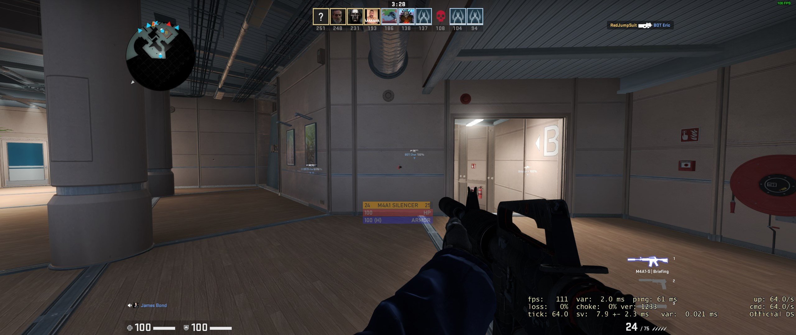

# CSGO Overlay HUD

# Intro
A small app made in Python that uses the Game State Integration APIs to provide a small and compact Qt-powered HUD below the crosshair in Counter Strike: Global-Offensive

## Setup
1. Close down CSGO
2. Copy `gsi/gamestate_integration_ichicoro.cfg` in your `<CSGO_install_dir>/csgo/cfg`
3. Install this app's requirements with `pip install PyQt5` (TODO: add `requirements.txt`)
4. Run the app! In a command line, type: `python main.py`
5. ???
6. Profit!

## Screenshot(s?)

_...yes it's small :P_

## TODOs
- Make setup simpler for noobs
- Add options for positioning, enabled items, etc...
- Add more screenshots